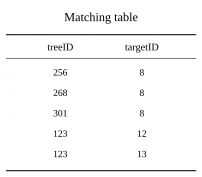
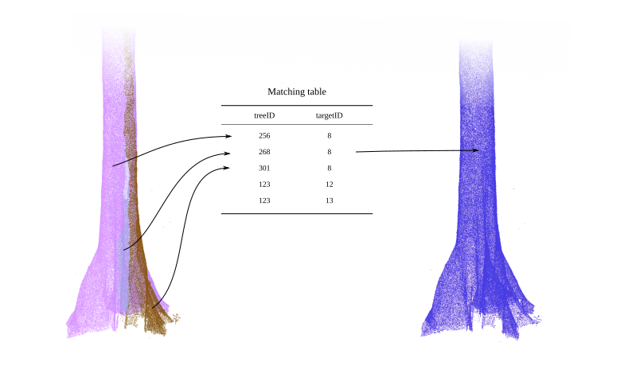
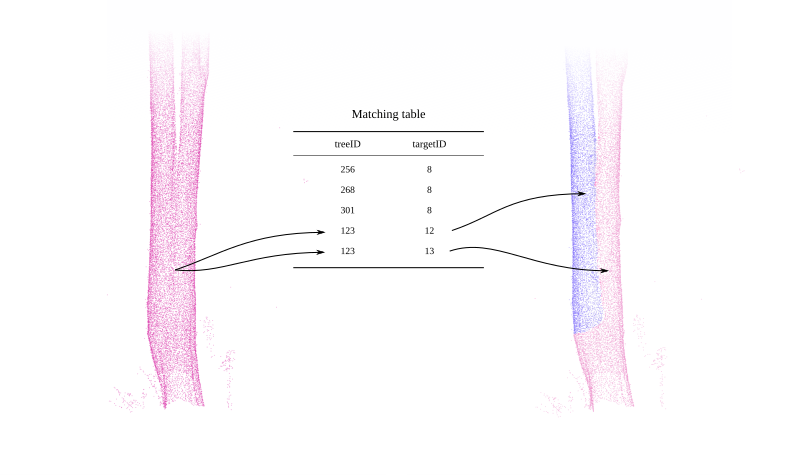

# arborInventoryMerger

`arborInventoryMerger` (short: AIM) package was designed for UMR AMAP (French lab) to enhance arbor's instance segmentation by merging in a spatially accurate ground-truth inventory.

While it is not specific to UMR AMAP's data, it requires highly accurate ground inventories in order to fix issues in the instance segmentation and reassign the correct tree IDs from the ground inventory to the corresponding inventory trees.

**Thus, this is not a general purpose tool.**

## Installation

``` r
# install.packages("pak")
pak::pak("r-lidar-lab/arborInventoryMerger")
```

## Tutorial

### 1. Segmentation

First, we need a segmented point cloud. Segmentation must be performed with [arbor](https://github.com/r-lidar/arbor) following the [guidelines](https://r-lidar.github.io/arbor_book/). We need both the segmented point cloud and the corresponding DTM.

### 2. Load the data

Load the inventory, the segmented point cloud, and the DTM.

```r
data <- data.table::fread("inventory.csv")
las  <- lidR::readTLS("segmented.laz")
dtm  <- terra::rast("dtm.tif")
```

### 3. Spatialize and validate the inventory

Convert the raw inventory `data` to an sf spatial object and check the validity of the data. Among other things, `aim_inventory()` checks whether tree IDs are integers, guesses column names, validates the absence of duplicates, checks for intersecting trees, and so on. Most errors committed by `arborInventoryMerger` are actually errors from the inventory, thus we backed it with a deep internal check of the reference data.

```r
inventory <- aim_inventory(data, dtm)
#> Column Detection Log
#>   Canonical: ID_Arbre   -> Detected: 'ID_Arbre'
#>   Canonical: X_correg   -> Detected: 'X_corrected'
#>   Canonical: Y_correg   -> Detected: 'Y_corrected'
#>   Canonical: DHP        -> Detected: 'DHP'
#>   Canonical: POM        -> Detected: 'POM'
#> Data Units & Quality Log
#>   [Info] DHP values all > 1. Converting from cm to metres (dividing by 100).
#>   [Warning] 322 trees outside DTM extent or missing Z elevation. These rows were removed.
#> Inventory Topology Check
#>   [Warning] Circles 64 and 65 overlap by 36.42%
#>   [Message] Circles 80 and 81 overlap by 3.68%
#>   [Warning] Circles 81 and 82 overlap by 38.97%
#>   [Critical] Circles 74 and 180 overlap by 100%
#>   [Warning] Circles 182 and 183 overlap by 69.57%
```

Depending on the quality of the data (mostly compliance to a valid standard), you may need to fix the data first by renaming some columns or converting strings to numbers. E.g.:

```r
data$ID_Arbre <- as.integer(data$ID_Arbre)
names(data)[5] <- "POM"
data <- dplyr::filter(data, !is.na(X_correg))
```

### 4. Filter trees outside the point cloud

To avoid errors from unmatched trees that fall outside the point cloud, remove those trees from the inventory.

```r
hull      <- sf::st_convex_hull(lidR::filter_poi(las, hag > 0.5, hag < 2))
inventory <- sf::st_filter(inventory, hull)
```

### 5. Compute the matching table

Compute the matching table.

```r
matching_table <- aim_matching_table(las, inventory)
```



### 6. Reassign IDs

Use the matching table to reassign tree IDs. This assigns each tree in the original arbor's segmentation the correct ID from the inventory, **and** repairs (to some extent) the segmentation of trees that may have been poorly segmented (especially large buttressed trees).

```r
las$treeID <- aim_reassign_ids(las$treeID, matching_table)
```



### 7. Split trees

In some cases, the matching table may contain a duplicated reassignment. This happens when arbor detects one tree (e.g., tree 123) but the inventory actually maps it to two or more trees (e.g., trees 12 and 13). In that case, the matching table finds that arbor's tree 123 must be reassigned to both inventory trees 12 and 13. This is impossible and generates a conflict. When this happens, use `aim_resolve_multi_matching()`. This function re-segments the trees using the inventory as a helper.

```r
las$treeID <- aim_resolve_multi_matching(las, matching_table, inventory)
```



### 8. Plot

Render in 3D to check the results

```r
gnd <- lidR::filter_poi(las, hag < 4)
x   <- arbor::plot_instance(gnd)
aim_add_inventory3d(x, inventory)

lasinventory <- lidR::filter_poi(las, treeID %in% inventory$ID_Arbre)
x <- arbor::plot_instance(lasinventory)
aim_add_inventory3d(x, inventory)
lidR::add_dtm3d(x, dtm)
```


### Debug tools

Debug and understand what is happening for a given tree with inventory's ID = `id`. This helps in understanding the internal routine and debugging some edge cases.

```r
tree <- dplyr::filter(inventory, ID_Arbre == id)
res  <- arborInventoryMerger:::aim_fit_tree(las, tree)
arborInventoryMerger:::aim_view(las, tree, res)
```
